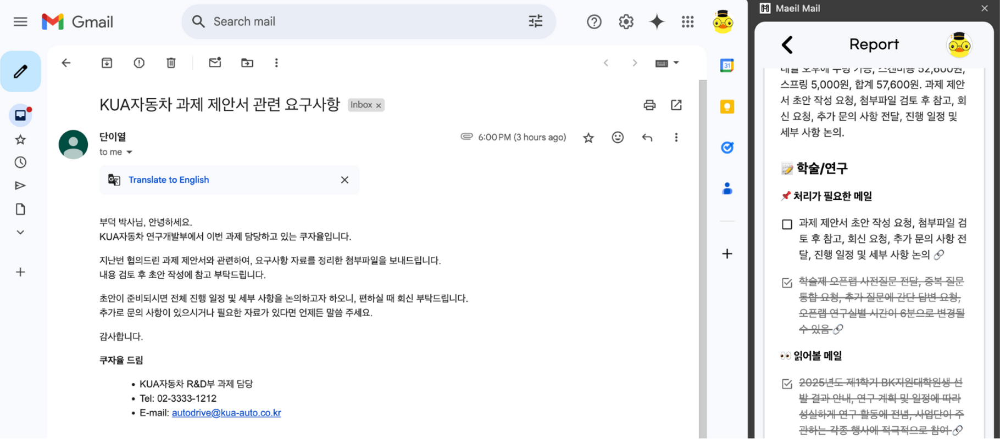
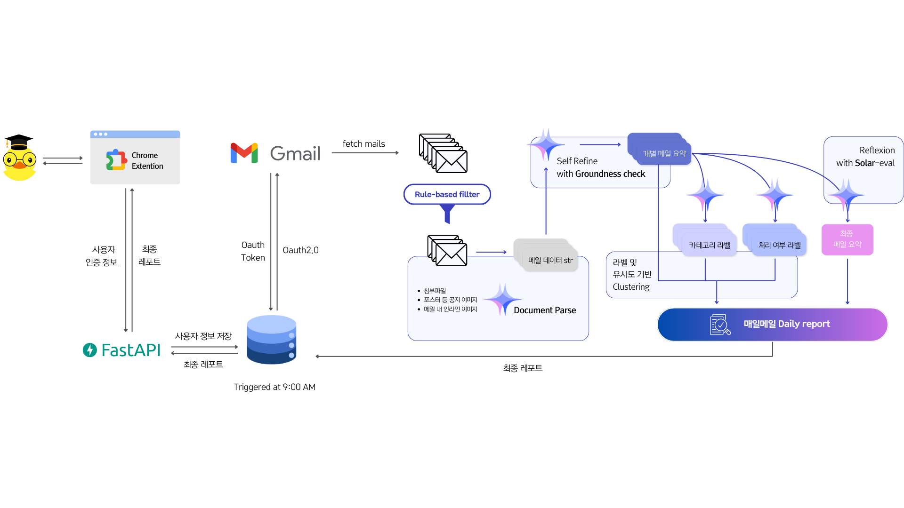
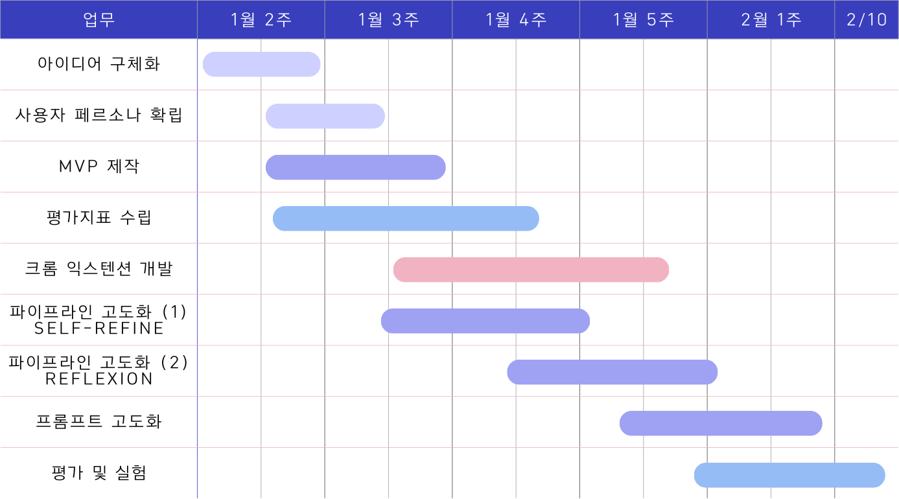
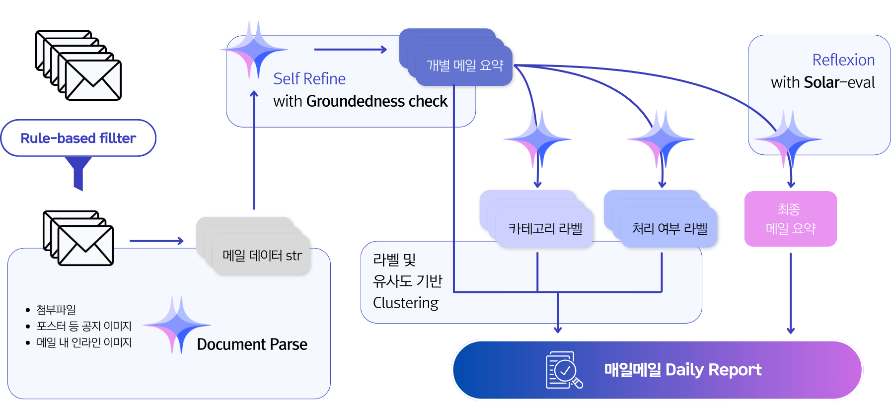
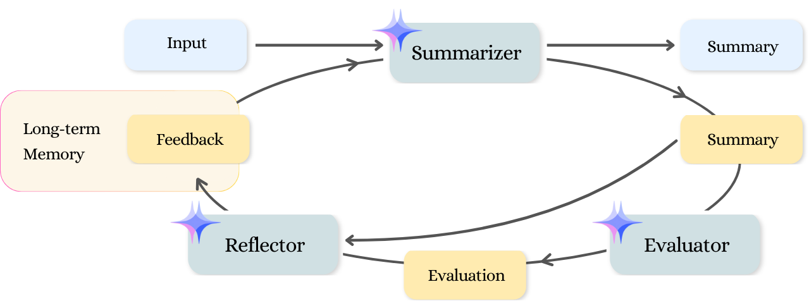

# 매일메일: 일간 메일 보고서 비서


매일 쌓이는 메일을 빠르게 파악하고, 중요한 정보를 놓치지 않도록 돕는 **LLM Agent 기반 Chrome Extension 서비스**입니다.

## 📌 프로젝트 개요

하루 동안 받은 메일을 요약한 보고서를 확인하고, 우선순위를 정해 업무를 효율적으로 처리할 수 있게 만듭니다.

> 프로젝트 진행 및 자세한 실험 내역은 [노션 링크](https://www.notion.so/gamchan/Upstage-234368a08ffd4965aad55b1a93b3cc3d?pvs=4)에서 확인하실 수 있습니다.

### 🪟 DEMO



> 1. `/assets/chrome_extension.zip`을 다운받아 압축해제합니다.
>
> 2. [chrome://extensions](chrome://extensions)에서 우상단의 `개발자 모드`를 활성화합니다.
>
> 3. 좌상단의 `압축해제된 확장 프로그램을 로드합니다.`를 선택하여 확장 프로그램을 로드합니다.

### ✨ 주요 기능

- **📩 메일 요약 & 보고서 제공**
  - 매일 오전 9시, 등록된 사용자들의 받은 메일을 요약해 보고서를 생성합니다.
  - `Reflexion` 기법을 활용해 간결하면서도 핵심적인 내용이 담기도록 반복적으로 정제합니다.
- **🔍 첨부파일 및 이미지 분석**
  - 메일 본문뿐만 아니라 이미지, 첨부파일의 내용까지 분석하여 중요한 정보를 포함합니다.
  - `Upstage Document Parse`를 활용하여 문서 내 정보를 효과적으로 추출합니다.
- **✅ 카테고리별 체크리스트 제공**
  - 메일을 `학술` / `행정` / `기타` 카테고리로 분류하여 요약된 내용을 제공합니다.
  - `Solar Pro`를 활용해 분류 및 요약을 진행하며, `Upstage Groundedness Check` 및 `Self-refine` 기법을 적용해 정확도를 향상시킵니다.
- **📂 유사 메일 자동 묶기**
  - 비슷한 주제의 메일을 자동으로 그룹화하여 읽기 부담을 줄입니다.
  - `Upstage Embedding` 모델을 활용하여 유사도를 기반으로 클러스터링합니다.

### 🏛️ System Structures



### 🗓️ Project Timeline



## 💯 평가 지표 및 결과

- [결과 정리](https://www.notion.so/gamchan/195815b39d3980078aa1c8e645bf435c?pvs=4)
- [실험 내용](https://www.notion.so/gamchan/18c815b39d39805e916ad56f39fa2c6b?pvs=4)
- [프롬프트 버저닝](https://www.notion.so/gamchan/c77dbeb277fd476bbc08d3ecab3ce3a2?v=398efc762f394868a3f241dd62ec48e0&pvs=4)

### 📝 개별 메일 요약

| Condition              | ROUGE-1 Recall | ROUGE-1 Precision | ROUGE-1 F1 | BERT Score Recall | BERT Score Precision | BERT Score F1 | G-EVAL Conciseness |
| ---------------------- | -------------- | ----------------- | ---------- | ----------------- | -------------------- | ------------- | ------------------ |
| Baseline               | 0.0667         | 0.0042            | 0.1678     | 0.8223            | 0.8789               | 0.8494        | 4.3958             |
| + refine               | 0.2618         | 0.2049            | 0.4649     | 0.8740            | 0.9146               | 0.8932        | 4.8750             |
| + one-shot             | 0.2288         | 0.2005            | 0.3661     | 0.8325            | 0.8905               | 0.8588        | 4.9375             |
| **+ refine, one-shot** | **0.3062**     | **0.2691**        | **0.4690** | **0.8905**        | **0.9319**           | **0.0901**    | **4.9167**         |

`ROUGE-1`에서 **24.0 ~ 30.1%p**, `BERTScore`에서 **5.3 ~ 6.8%p**, `G-Eval conciseness` 항목(5점 만점)에서 **0.52점** 상승폭이 있었습니다.

> [요약 G-eval 평가 항목 별 프롬프트](prompt/template/summary/g_eval/)

### 🏷️ 메일 분류

| Condition                | Accuracy   | Tokens     | Accuracy per Token |
| ------------------------ | ---------- | ---------- | ------------------ |
| Baseline                 | 0.8104     | 97,436     | 8.32e-6            |
| **summary based**        | 0.7708     | **52,477** | **1.47e-5**        |
| summary based + 1-shot   | 0.8021     | 63,599     | 1.27e-5            |
| summary based + 5-shots  | 0.7708     | 86,878     | 8.87e-6            |
| summary based + 10-shots | **0.8146** | 115,558    | 7.05e-6            |

`정확도/토큰 사용량` 지표를 바탕으로 현재 프롬프트를 채택했습니다.

### 📜 최종 리포트

| Condition                                                 | G-eval score |
| --------------------------------------------------------- | ------------ |
| Self-Refine: Baseline                                     | 3.75         |
| Self-Refine: Detailed Instructions                        | 3.50         |
| Self-Refine: Detailed Instructions + Formatting Penalty   | 3.94         |
| Reflexion: Baseline                                       | 4.00         |
| Reflexion: Detailed Instructions                          | 3.50         |
| **Reflexion: Detailed Instructions + Formatting Penalty** | **4.19**     |

`G-Eval` 평가 평균 점수(4.5점 만점)에서 **0.44점** 상승이 있었습니다.

> [리포트 G-Eval 평가 항목 별 프롬프트](prompt/template/reflexion/g_eval/)

## 👥 Collaborators

<div align="center">

|                                                   팀원                                                    |                                 역할                                  |
| :-------------------------------------------------------------------------------------------------------: | :-------------------------------------------------------------------: |
|     <a href="https://github.com/gsgh3016"></a>     |  Self-refine 및 클러스터링 구현, 요약 및 분류 평가 진행, 서비스 개발  |
|       <a href="https://github.com/eyeol"> </a>        |   페르소나 세부 설정, 평가용 데이터셋 구성 및 제작, 평가 지표 설계    |
|    <a href="https://github.com/jagaldol">  </a>    | 파이프라인 설계, Reflexion 구현, 서비스 개발, DB 관리, 코드 품질 관리 |
|     <a href="https://github.com/Usunwoo">  </a>     |  PM, 기획 및 디자인(UI/UX), 파이프라인 설계, 요약 및 분류 평가 진행   |
| <a href="https://github.com/canolayoo78">  </a> |  Gmail 데이터 파싱 및 Mail Class 구현, 분류 파이프라인 설계 및 구현   |
|   <a href="https://github.com/chell9999">  </a>   | 페르소나 설정, Reflexion 구현 및 고도화, 최종 요약 G-eval 평가 고도화 |

</div>

## 🛠️ Tools and Technologies

<div align="center">


</div>

## 🚀 Core Pipeline



### 📩 mail 데이터 텍스트화

다양한 첨부 파일과 사진 등 비정형 데이터가 포함된 메일 데이터를 `LLM`이 이해할 수 있는 텍스트로 변경

- **Rule-based Filtering**
  - LLM 토큰의 효율적 활용을 위해 광고 메일은 파이프라인에서 제외
- **Upstage Document Parse**
  - 이미지에 포함된 텍스트 추출
- **Mail Metadata**
  - 받은 시간, 보낸 이 정보 등 메타데이터를 함께 활용

### 📝 개별 메일 요약

개별 메일들을 요약하여 체크리스트화


- **LLM을 통한 요약**
  - `Upstage Solar Pro` 활용
- **Upstege Groundedness Check**
  - 원문과의 불일치나 사실관계 오류가 없는지 검증
- **Self-Refine**
  - 지정한 요약문 형식을 따르고 있는지 `Self-Refine`을 통한 검토
- **유사 메일 묶기**
  - 메일 제목 및 요약문을 `Embedding`해 유사한 메일들을 하나의 그룹 설정

#### 🗣️ 프롬프트

- [메일 요약 시스템 프롬프트](prompt/template/summary/single_summary_system.txt)
- [메일 요약 사용자 프롬프트](prompt/template/summary/single_summary_user.txt)
- [self refine 관련 프롬프트들](prompt/template/self_refine/)

### 🏷️ 메일 분류

요약된 메일 정보를 기준으로 다중 분류 진행

- **카테고리 분류**
  - `학술/연구`, `행정 처리`, `기타`
- **처리 필요 여부 분류**
  - `처리 필요`, `읽기`

#### 🗣️ 프롬프트

- [메일 분류 시스템 프롬프트](prompt/template/classification/single_classification_system.txt)
- [메일 분류 사용자 프롬프트](prompt/template/classification/single_classification_user.txt)

각 분류의 기준은 다음과 같이 전달됩니다:

- [목적 별 분류](prompt/template/classification/category.yaml)
- [추가 행동 필요 여부 분류](prompt/template/classification/action.yaml)

### 📜 최종 리포트 생성

개별 요약문들을 활용하여 `Reflexion` 루프를 통해 수신된 이메일들의 핵심을 정리하여 최종 레포트 생성



#### 🗣️ 프롬프트

- [최종 리포트 시스템 프롬프트](prompt/template/reflexion/single_reflexion_system.txt)
- [최종 리포트 사용자 프롬프트](prompt/template/reflexion/single_reflexion_user.txt)
- [Evaluator(G-Eval) 평가 항목 별 프롬프트](prompt/template/reflexion/g_eval/)
- [self refletion 생성 프롬프트](prompt/template/reflexion/reflexion_final.txt)

## ⚙️ Project Quick Setup

### 1. Git Clone

```shell
$ git clone git@github.com:boostcampaitech7/level4-nlp-finalproject-hackathon-nlp-06-lv3.git
$ cd level4-nlp-finalproject-hackathon-nlp-06-lv3
```

### 2. Create Virtual Environment

```shell
$ python -m venv .venv
$ source .venv/bin/activate
(.venv) $
```

### 3. Install Packages

```shell
(.venv) $ pip install -r requirements.txt
(.venv) $ sudo apt-get install build-essential
```

### 4. Setup Environment Variables

4.1. `.env`를 생성 후 환경 변수를 수정합니다.

```shell
(.venv) $ cp .env.example .env
```

- Upstage API Key는 [여기](https://console.upstage.ai/api-keys?api=chat)에서, Openai API Key는 [여기](https://platform.openai.com/welcome?step=create)에서 발급해주세요.
- Google Client ID 및 Google Client Secret은 [다음 게시물](https://www.notion.so/gamchan/OAuth-179815b39d398017aeb8f6a8172e6e76?pvs=4)을 참고해주세요.

```shell
# AI Service
UPSTAGE_API_KEY=your_upstage_api_key
OPENAI_API_KEY=your_openai_api_key

# Google OAuth 2.0(with GMail)
GOOGLE_CLIENT_ID=1234567890.apps.googleusercontent.com
GOOGLE_CLIENT_SECRET=1234567890
```

4.2. `main.py`를 실행하기 위해서 `client_secret_...usercontent.com.json` 파일 이름을 `credentials.json`으로 변경해주세요.

### 5. Execute pipeline

```shell
(.venv) $ python main.py
```

### (Optional) Execute with DB connection

```shell
(.venv) $ docker-compose -f server/docker-compose.yml up -d
(.venv) $ python batch_main.py
```

## 📖 Contribution Guide

프로젝트에 기여하는 방법에 대한 [가이드](https://github.com/boostcampaitech7/level2-nlp-generationfornlp-nlp-06-lv3/blob/main/CONTRIBUTING.md)입니다.

### 커밋 템플릿 사용법

프로젝트에서 커밋 메시지 형식을 통일하기 위해 커밋 템플릿을 설정할 수 있습니다. 아래 명령어를 실행하여 템플릿을 적용하세요:

```
$ git config commit.template .gitcommit_template
```

- `.gitcommit_template` 파일은 프로젝트 루트에 있는 커밋 템플릿 파일입니다.
- 위 명령어를 실행하면 커밋 시 템플릿이 자동으로 불러와집니다.

## 🔬 References

- Aman Madaan, Niket Tandon, Prakhar Gupta, Skyler Hallinan, Luyu Gao, Sarah Wiegreffe, Uri Alon, Nouha Dziri, Shrimai Prabhumoye, Yiming Yang, Shashank Gupta, Bodhisattwa Prasad Majumder, Katherine Hermann, Sean Welleck, Amir Yazdanbakhsh, Peter Clark, "Self-Refine: Iterative Refinement with Self-Feedback", 25 May, 2023. https://arxiv.org/abs/2303.17651.
- Noah Shinn, Federico Cassano, Edward Berman, Ashwin Gopinath, Karthik Narasimhan, Shunyu Yao, "Reflexion: Language Agents with Verbal Reinforcement Learning", 10 Oct, 2023. https://arxiv.org/abs/2303.11366.
- Lianmin Zheng, Wei-Lin Chiang, Ying Sheng, Siyuan Zhuang, Zhanghao Wu, Yonghao Zhuang, Zi Lin, Zhuohan Li, Dacheng Li, Eric P. Xing, Hao Zhang, Joseph E. Gonzalez, Ion Stoica, "Judging LLM-as-a-Judge with MT-Bench and Chatbot Arena", 24 Dec, 2023. https://arxiv.org/abs/2306.05685.
- Yang Liu, Dan Iter, Yichong Xu, Shuohang Wang, Ruochen Xu, Chenguang Zhu, "G-Eval: NLG Evaluation using GPT-4 with Better Human Alignment", 23 May, 2023. https://arxiv.org/abs/2303.16634.
- Yukyung Lee, Joonghoon Kim, Jaehee Kim, Hyowon Cho, Pilsung Kang, "CheckEval: Robust Evaluation Framework using Large Language Model via Checklist", 27 Mar, 2024. https://arxiv.org/abs/2403.18771.
- Sergio Rojas-Galeano, "Zero-Shot Spam Email Classification Using Pre-trained Large Language Models", 24 May, 2024. https://arxiv.org/abs/2405.15936.
